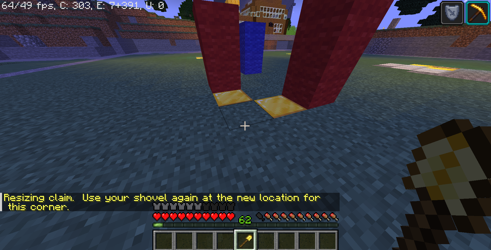
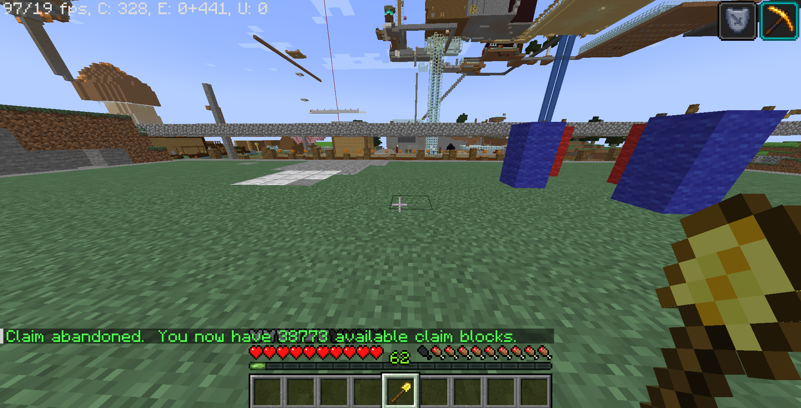

# 保護について
きのこサーバーでは、GriefPreventionを使って、土地の保護を行えます。

## 保護取得方法
1. 金のシャベルを右手に持ちます。
 

2. 保護する始点を右クリックします。

3. 対角線を伝って反対側のブロックを右クリックします。(終点ブロックを右クリック)

## 保護の広さを変更する方法
1. 取得済みの土地で金のシャベルを持って変更したい部分の端のグローストーン部分を右クリックする。

2. 拡大・縮小したい部分で右クリックする。(保護は四角形じゃないと作成できません(例外あり))

## 保護を削除する方法
1. 保護したブロック範囲に立ちます。

2. `/AbandonClaim`を実行すると削除できます。

## 保護ブロック数について
1時間プレイすると、250ブロック数の保護数値ブロックがもらえます。

最大保護ブロックは、100000以下ブロックです。

`World`以外のワールドでは、保護機能は無効になっています。

## コマンドリスト
|コマンド|機能|権限|
| --- | --- | --- |
|/AbandonClaim|今立っている場所の取得された土地を削除します。一度取得された場所を取り直したい場合などに使います。|player|
|/ClaimExplosions|取得した土地で爆発が許可されているかどうかを切り替えます。|player|
|/Trust [player]|別のプレーヤーにあなたの取得した土地を編集する許可を与えます。|player|
|/UnTrust [player]|別のプレーヤーに付与された権限を取り消します。|player|
|/AccessTrust [player]|ボタン、レバー、ベッドの使用をプレーヤーに許可します。|player|
|/ContainerTrust [player]|ボタン、レバー、ベッドの使用をプレーヤーに許可します。|player|
|/TrustList|自分が取得した土地の一覧を表示します。|player|
|/SubdivideClaims|シャベルを細分化モードに切り替えて、土地の取得を細分化できるようにします。|player|
|/RestrictSubclaim|SubdivideClaimsを使って細分化した土地を元の土地の権限を継承しないようにします。|player|
|/BasicClaims|シャベルを基本モードに戻します。|player|
|/PermissionTrust [player]|他のプレイヤーに自分の許可レベルを他の人と共有する許可を与えます。Trustした人に自分と同じ権限を渡したいときに使います。|player|
|/AbandonAllClaims|自分が取得した土地の権利をすべて削除します。|player|
|/ClaimsList|プレーヤーの取得した土地と詳細を一覧表示します。|player|
|/Trapped|他のプレーヤーの取得した土地から出られなくなった時に外に出られるコマンド|player|