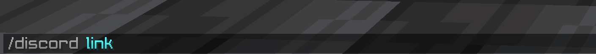
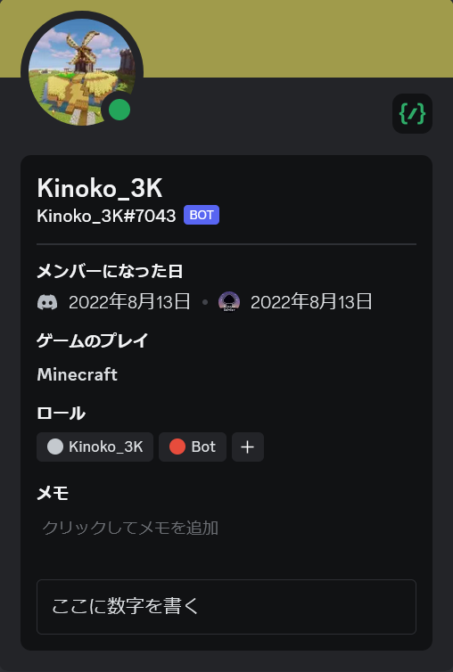
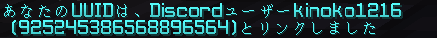

# DiscordとMinecraftアカウントを連携
DiscordとMinecraftアカウントを接続すると、DiscordサーバーのほとんどのVCに参加できるようになったり、Discordからサーバー内宣伝ができるようになります。

## 連携方法
1. `/discord link`をMinecraftサーバー内(Life鯖)で実行します。


2. 実行すると、
```
あなたのリンクコードは0000です。あなたのアカウントとリンクするために、このコードだけを含むメッセージをDiscord上のボット(Kinoko_3K)にPMを送ってください。
```
と表示されるので、`0000`のランダムな数字をDiscordの「Kinoko_3K」という名前のボットのDMに送ります。
*PM = Private Message
*DM = Direct Message


3. 画像の`ここに数字を書く`というところに、さっきの生成されたランダムな数字を入力して送信してください。


4. ランダムな数字をボットに送信すると、メッセージとして
```
あなたのDiscordアカウントは、MCID (UUID)とリンクしました
```
と表示されます。


5. そして、Minecraftの方のチャット欄で、画像のようなメッセージが出たら成功です。
