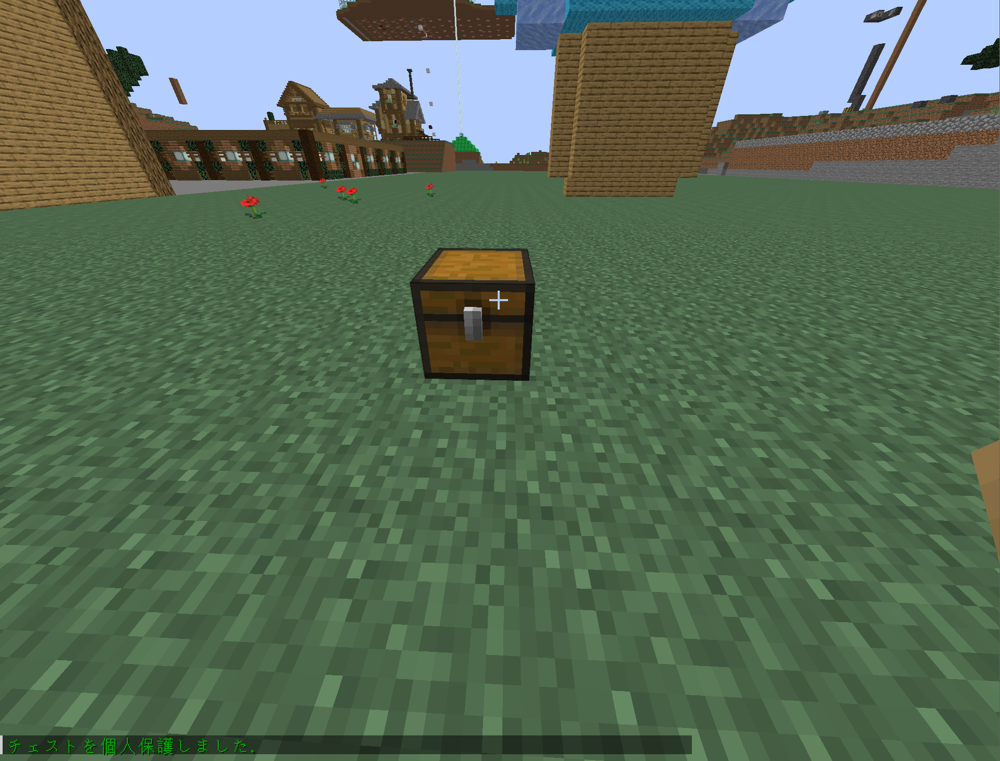
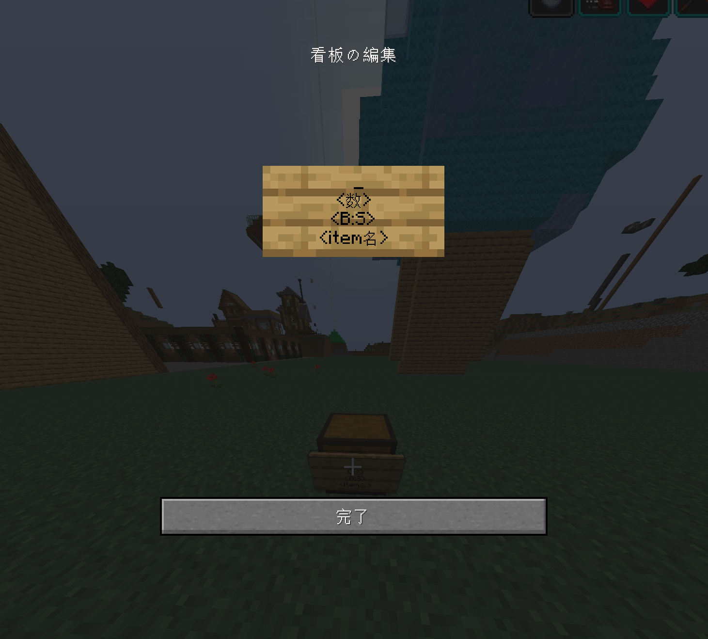

# 経済要素について
Lifeサーバーには、少しの経済要素が導入されています。

`円・銭`という単位を使用していますが、ユーザ側にわかりやすくするためだけであり、**RMT(リアルマネートレーディング)ではありません。**

**この機能を使用し、現実のお金が減ることはありません。減るのは鯖主の財源費(電気代・回線代)だけです。**

現在は、お金のやり取りとChestShop程度しか使用できませんし、このまま経済が本要素となることはしません。([経済要素についての見解](##経済要素についての見解))

## コマンド集
### Jecon (お金関係)
| CommandName | Value |
| --- | --- |
| `/money` | 所持金を表示 |
| `/money show <player>` | 他プレイヤーの所持金を表示 |
| `/money pay <player> <amount>` | 指定した数のお金をプレイヤーに送信 |

### ChestShop (お店関係)
| CommandName | Value |
| --- | --- |
| `/iteminfo` | アイテムの詳細を表示 |
| `/shopinfo` | 目の前にあるChestShopの詳細を表示 |

## ChestShopの作り方
1. チェストを置きます。(保護が剝がれる場合があるので、Shop作った後は`/cprivate`)

2. チェストの中に、売りたい / 買い取りたいアイテムを入れます。
3. チェストに看板を貼る

- 1段目 
    - 何も書かない
- 2段目
    - 売りたい / 買い取り したいアイテムの数を記入する
    - リンゴを**３個売りたい**のであれば、`3`と記入する
    - 金のリンゴを**５個買い取りたい**のであれば、`5`と記入する
- 3段目
    - B = Buy(売る) / S = Sell(買い取る)
    - リンゴを10円で売りたいなら、`B10`と記入する
    - 金のリンゴを50円で買い取りたいなら、`S50`と記入する
    - リンゴを20円で売って、10円で買い取りたいなら、`B20:S10`と記入する
- 4段目
    - アイテムの英語名を記入する (アイテムは`F3+H`で`minecraft:<item_name>`が表示可能)
    - リンゴなら`apple`
    - 土なら`dirt`

4. 看板を設置すると、勝手に`1段目`に自分の名前が記入されてショップが作成できる。

## ChestShopの売り方 / 買い方
- 売るとき
    - 売るときは、看板に向かって、**左クリック**する。(アイテムをメインハンドに持っていなくても可能)
- 買い取るとき
    - 買い取るときは、看板に向かって、**右クリック**する。(アイテムをメインハンドに持っていなくても可能)

※ 自分のChestShopは、売買ができません。

## アイテムの値段について
### 【高価な通常アイテム】(50000以上(5万以上)で売買してください)
- 名札
- ポーション類
- 特別な地図
- エンチャントテーブル
- エンドチェスト
- シェルカー

### 【高価な特別アイテム】(500000以上(50万以上)で売買してください)
- コマンドブロック
- ドラゴンの卵
- 金のリンゴ
- エンチャントされた金のリンゴ
- ビーコン
- コンジット
- エンドクリスタル     
- エンチャントされた防具や道具、武器
- レコード
- エンチャント本
- 不死のトーテム
- ネザースター
- 海洋の心
- Mobの頭
- プレイヤーの頭
- エリトラ
- その他(名前の色が違うアイテム)

### 装備・防具・ツールについて
| 素材 | 種類 | 何円以上 |
| --- | --- | --- |
| ネザライト | すべてのツール・装備 | 5万以上で売買してください |
| ダイヤモンド | すべてのツール・装備 | 2万以上で売買してください |
| 金 | すべてのツール・装備 | 1万以上で売買してください |
| 鉄 | すべてのツール・装備 | 5000円以上で売買してください |
| 石 | すべてのツール | 500円以上で売買してください |
| 木 | すべてのツール | 100円以上で売買してください |