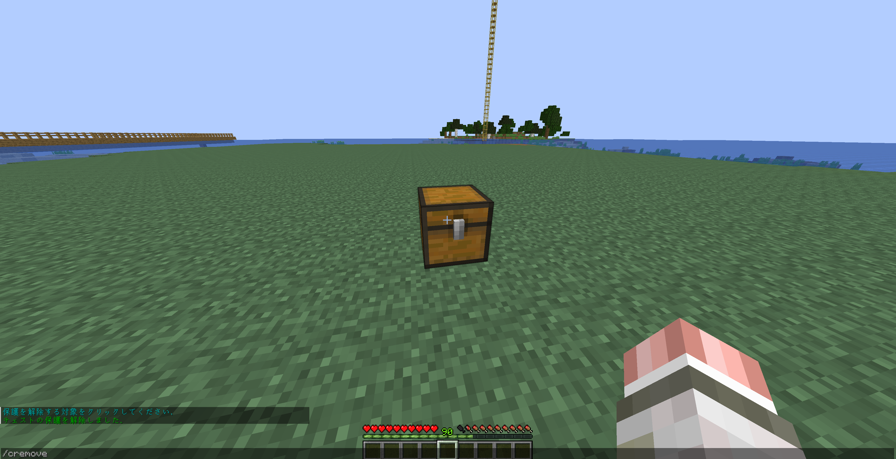

# LWCについて
チェストやドアなど、ブロックとして動くものは保護できるようになっています。

また、保護しているブロックに関しては、基本プレイヤーは触れなく、自身の保護したブロックのみ使うことができます。

## 保護について
### チェストを設置すると勝手に保護されます。

### 保護を消すときは`/cremove`または`/unlock`した後に対象ブロックを左クリックします。

### 保護種類について
- 個人保護
    - 自分だけ使用できる状態にします。
- 共有保護
    - 他プレイヤーも使用できる状態にします。
- 寄付保護
    - 他プレイヤーは物を入れることができ、自分だけ取り出せる状態にします。
- 提供保護
    - 他プレイヤーは物を取り出せることができ、自分だけ物を入れることが可能な状態にします。
- パスワード保護
    - パスワードを知っているプレイヤーのみが使用できる状態にします。

### コマンドリスト
| コマンド名 | 概要 |
| --- | --- |
| `/cprivate` | 個人保護にします。 |
| `/cpublic` | 共有保護にします。 |
| `/cdonation` | 寄付保護にします。 |
| `/csupply` | 提供保護にします。 |
| `/cpassword [password]` | パスワード保護にします。 |
| `/cmodify [private/public/donation/supply..]` | 個人保護から別の設定に変更します。 |
| `/cunlock [password]` | パスワード保護を解除します。 |
| `/cinfo` | 保護の情報を表示します。 |
| `/cremove` | 保護を削除します。 |
