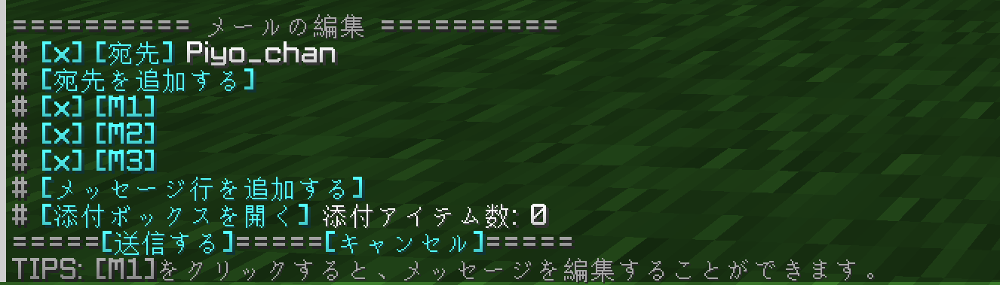
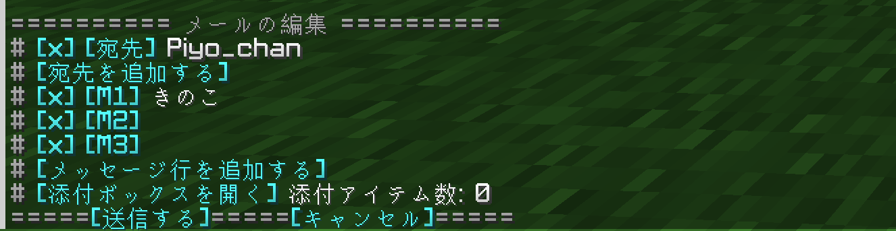
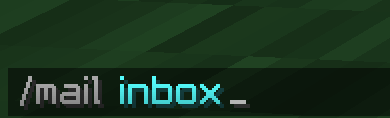
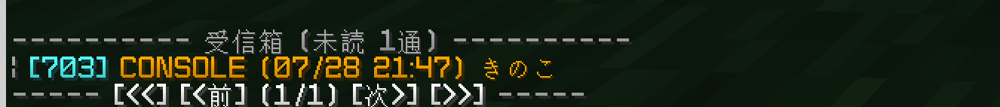
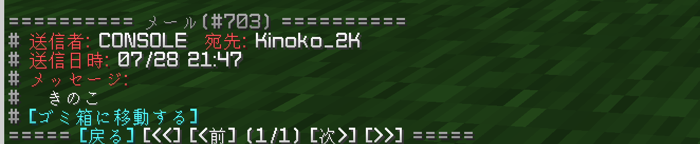

# メールについて(UndineMailer)
きのこサーバーでは、UndineMailerを使って、プレイヤー同士でメールを受送信できます。

## メールを他プレイヤーに送信する方法
1. `/mail write <送りたい相手のmcid>`を実行します。

    

2. `[X] [M1]`を押す、または`/mail message 1 <メッセージ>`を実行します。

   

3. `[送信する]`を押す、または`/mail send`を実行します。

   

4. `メールを送信しました。`という表示が出たら、送信成功です。

   

## メールを他プレイヤーから受信する方法
1. `/mail inbox`を実行します。

   

2. オレンジ色の文字で書かれているメッセージは新規メール、灰色だと既読メールです。
   メッセージを押すと、メールが開かれます。

   

3. この表示が出ることで、メールを開くことができます。
   メールを開いた後はゴミ箱に送ることをお勧めします。

   

## コマンドリスト
| コマンド | 機能 |
| --- | -- |
| `/mail inbox` | メール受信箱を開きます。 |
| `/mail outbox` | メール送信箱を開きます。 |
| `/mail trash` | ゴミ箱を開きます。 |
| `/mail text [mcid] [メッセージ]` | 単純なテキスト1行のメールを送信します。 |
| `/mail write [mcid]` | メール編集画面を開きます。 |
| `/mail item` | 手に持ったアイテムの詳細を表示します。 |
| `/mail help` | help画面を表示します。 |