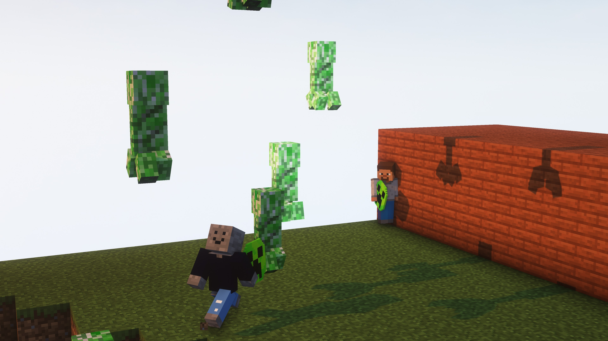

# Minigameサーバー
このサーバーは、ミニゲームが遊べるサーバーです。

現在、**Boooomという「きのこサーバー」発の自作Minigame**とアスレチックが遊べるようになっております。

アスレチックは、随時運営が種類を増やしています。

Boooomは、**運営がバグ修正や意見等を取り入れてリリースしているもの**です。なので安定して遊べるようになっています。

## Boooomの説明
二人プレイのPvPです。

**TNTやクリーパーを投げて相手を吹き飛ばそう！**(直接殴れません。棒を使うことで投げることが可能です。)

先に相手のHPを0にすれば勝利！！

※すべてのアイテムは、右クリックまたは右ボタンで使用可能です！

## ミニゲームサーバー写真等

## Minigame鯖のルール

このルールは、Minigame鯖のみであり、全体ルールは別で定めてあります。

次の行為は迷惑行為とみなされ、破った場合は処罰を課せられる場合があります。

### サーバーによって禁止されている行為
- 複数アカウントからの接続(2つまで)
- 悪意のあるMODや割れを使用して接続する場合
- 権限を複製し、荒らし行為などを実行・助長する行為

### KinokoNetWorkからのサービスの提供に支障をきたす行為
- サーバーに攻撃(Dos,DDos)やサービスの提供に支障を発生したり負荷がかかる行為を禁止しています。
- サーバー(物理)に攻撃した場合は電子計算機損壊等業務妨害罪に問われたりするらしいのでしないでください。
- サーバーにBotやCrackingアカウントを使って接続する行為は禁止されています。

### 利用者同士の問題について
- 他の利用者が不快に思ってたり声を上げているのにも関わらずやり続ける行為は処罰される場合があります。
- 楽しく過ごせるようにするために運営は動いているので、利用者についての相談は運営までお願いします。
- スパム(メッセージの連続投稿)・悪口(誹謗中傷)・R18言動などは処罰対象になります。

### MODの利用について
- Optifineや日本語MOD以外のMODは基本的には認めてはいません。それ以外で鯖が弾き飛ばされる場合は、自己責任でお願いします。
- 一応、利用者様同士の格差が生まれないMODなら大丈夫だと思います。
- 現在承認しているModは、インベントリ整理・軽量化・日本語翻訳などです。

### 不正行為について
- 以下の行為は不正行為として、Banなどの各種処罰、勝ち数やスコアのリセットなどの対象となる場合があります。
- 1人で複数のプレイヤーを操作、複数の画面の視聴などをすることにより、ゲームの勝利数、レート、スコアなどを本来意図しない方法で変更する行為
- MODやチートクライアント、リソースパック等により、大幅に有利な状態が発生していると運営が判断した場合
- その他運営が不適切だと判断する行為

### スクリーンショットや配信について
- スクリーンショットについては、プレイヤー同士の喧嘩や不利益が発生した場合、運営は責任を負いません。
- また、第三者について飛び火があった場合、利用者同士の問題で処罰される恐れがあります。
- 配信は、サーバの被害になるもの(荒らし・バグ利用など)以外は許可しています。

### 運営について
- 運営はどんな立場だとしても、公平に処罰を行わないといけない。
- 不正に情報を流失させたり盗む場合は、重い処罰が課せられる場合があります。
- サーバーを停止したり再起動、reloadなどをしないといけない場合は、原則として利用者様方が不在のときに実行してください。
- なお、サーバーに運営しかいない場合は、再起動しても良い。

### 運営向けに追記: 
- @TomiK5303作成のミニゲームで何か問題が発生した場合は、事前にお伝えしてあるゲームのリセット操作のみを行い、実施した事を報告するようにしてください。勝ち数の変更、その他scoreboardの調整は原則として @TomiK5303が行います。ただし、私、または鯖主など権限上において上の方から指示ががあった場合はこの限りではありません。

2023/01/05 細かいルール変更

2023/01/09 記法など若干変更